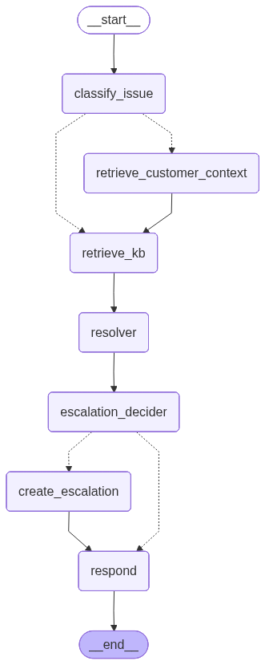

This is the design document for the solution for building UDA-Hub, a Universal Decision Agent designed to plug into existing customer support systems and intelligently resolve tickets. The agentic system reads, reasons, routes, and resolves, acting as the operational brain behind support teams. It is designed to:
  o	Understand customer tickets across channels
  o	Decide which agent or tool should handle each case
  o	Retrieve or infer answers when possible
  o	Escalate or summarize issues when necessary
  o	Learn from interactions by updating long-term memory

A.	Tools using MCP:
Using  FastMCP with the following tools:
1.	get_customer_profile - Returns CultPass customer profile details for a given customer ID.
2.	get_customer_reservations - Returns reservations for a given customer ID.
3.	search_support_articles - Searches for support articles using lightweight intent-aware keyword matching with ranking.
4.	search_customer_tickets - Returns support tickets for a given external customer ID.
5.	create_escalation - Creates customer escalations when an agent determines escalation is required.

B.	Agents
The following agents were created for this solution using 2 classes to outline the specific fields that are used and the indicated tools:
Classes:
1.	SupportState
	- user_id: str
    - user_message: str
	- issue_type: IssueType
	- issue_summary: str
	- needs_escalation: bool
	- create_new_escalation: bool
	- needs_human_review: bool
	- final_response: str
	- error: str
	- profile: dict[str, Any] | None
	- customer_profile: dict[str, Any] | None
	- reservations: dict[str, Any]
    - tickets: dict[str, Any]
	- articles: dict[str, Any]
	- investigation_summary: str
	- customer_context_summary: str
	- kb_query: str
	- kb_summary: str
	- resolver_outcome: ResolverOutcome
	- resolution_confidence: ResolutionConfidence
	- safe_to_auto_resolve: bool
	- requires_customer_context: bool
	- customer_message: str
	- escalation_reason: str
	- escalation_tags: list[str]
	- escalation_result: dict[str, Any]
	- existing_escalation_status: str
	- routing: dict[str, Any]

2.	EscalationDecision
   - needs_human_review: bool
   - create_new_escalation: bool
   - reason: str
   - tags: list[str]
Agents:
1.	classify_issue_node - Classifies issues based on various keywords. No tools used.
2.	customer_context_node - Determines customer context, background and history. Tools used get_customer_profile, get_customer_reservations, search_customer_tickets.
3.	kb_retrieval_node - Agent retrieves knowledge base article information. Uses search_support_articles tool.
4.	resolver_node - A very important agent with a prompt specifying that it is a customer support resolver. It decides whether an issue is resolved, unresolved or needs escalation taking a conservative approach regarding escalation. Guidance consists of:
  o	General guidance, FAQ, policy explanations, cancellation steps, rescheduling steps, and booking how-to questions typically are not be escalated.
  o	If the available articles or customer context support a helpful next-step answer, mark "Resolved" does NOT require completing a backend action. It is enough to give safe, grounded guidance based on the provided context.
  o	Use "unresolved" only when the available information is not enough to answer and human intervention is not clearly required.
  o	Use escalation only when the issue clearly requires human staff action, sensitive intervention, account intervention, dispute handling, safety handling, or manual review.
  o	Does not invent policies, refunds, credits, reservation changes, or account actions.
  Reservation-specific guidance:
  o	Does NOT require reservation details for generic how-to questions such as:
    • How to cancel a reservation
    • How to reschedule or change a booking
    • General booking help
    • If support articles provide relevant guidance for those questions, mark the issue as resolved.
    • Requires customer context when the user is asking about a specific existing reservation or requesting action on a specific booking.
    • Treats messages about bookings, reservations, trips or requests to cancel/change/reschedule an existing booking as customer-context-dependent.
     Generic questions like "how do I cancel a reservation?" are NOT customer-context-       dependent. No tools used.
5.	escalation_decider_node - Agent decides whether escalation is needed. Tool used create_escalation.
6.	create_escalation_node - Creates escalations using the create_escalation tool.
7.	respond_node - An agent that provides a final response. Not tools used.

C.	Orchestrator and Workflow:
1.	Orchestrator using graph StateGraph SupportState.
2.	Workflow nodes:
    graph.add_node("classify_issue", classify_issue_node)
    graph.add_node("retrieve_customer_context", customer_context_node)
    graph.add_node("retrieve_kb", kb_retrieval_node)
    graph.add_node("resolver", resolver_node)
    graph.add_node("escalation_decider", escalation_decider_node)
    graph.add_node("create_escalation", create_escalation_node)
    graph.add_node("respond", respond_node)
3.	Workflow edges:
    graph.add_edge("retrieve_customer_context", "retrieve_kb")
    graph.add_edge("retrieve_kb", "resolver")
    graph.add_edge("resolver", "escalation_decider")

 
D.  The chat_interface function in utils.py was improved so it works better than the orginal.

E.  Flow diagram for solution

Run solution with ticket test cases from 03_agentic_app.ipvnb notebook.

F.  References
1. Udacity AI Assistant as a developer consultant to develop and test code annd generate synthetic database entries and tickets for this project.
2. Agentic AI Engineer with LangChain and LangGraph Nanodegree Course 3 Advanced Agentic AI Techniques course materials.

